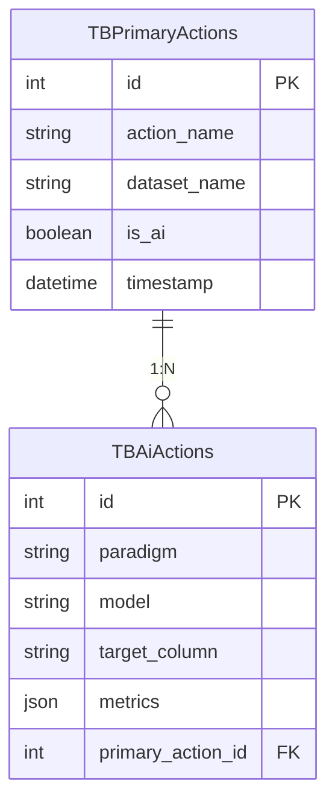
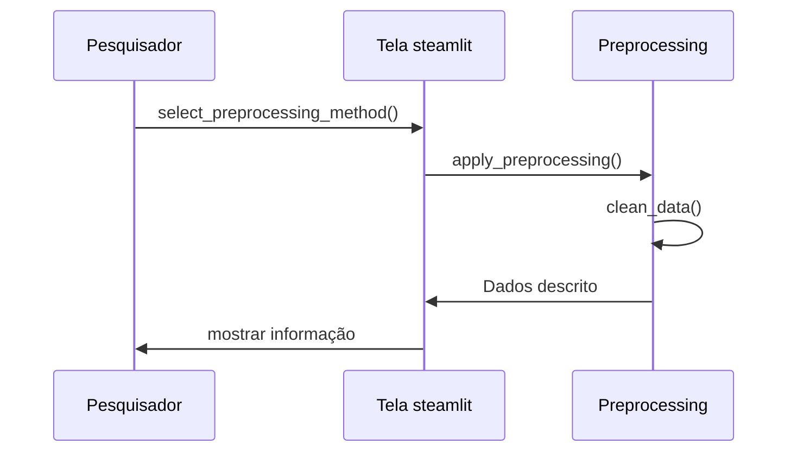

# Estágio

## Installation

To set up the project, follow these steps:

1. Create a virtual environment:
    ```bash
    python -m venv env
    ```

2. Activate the virtual environment:
    - **Windows**:
        ```bash
        env\Scripts\activate
        ```
    - **Unix or MacOS**:
        ```bash
        source env/bin/activate
        ```

3. Install the required dependencies:
    ```bash
    pip install -r requirements.txt
    ```

## Usage

To run the project, execute the following command:
```bash
streamlit run main.py
```

## Diagram

### DER Diagram


### Sequence Diagram


