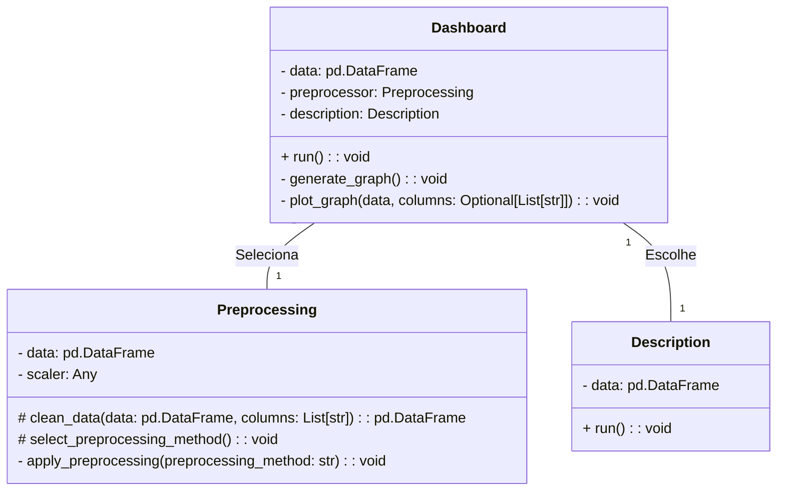

```mermaid
classDiagram
    class Preprocessing {
        - data: pd.DataFrame
        - scaler: Any
        # clean_data(data: pd.DataFrame, columns: List[str]): pd.DataFrame
        # select_preprocessing_method(): void
        - apply_preprocessing(preprocessing_method: str): void
    }
    class Dashboard {
        - data: pd.DataFrame
        - preprocessor: Preprocessing
        - description: Description
        + run(): void
        - generate_graph(): void
        - plot_graph(data, columns: Optional[List[str]]): void
    }
    
    class Description {
        - data: pd.DataFrame
        + run(): void
    }
    
Dashboard "1" -- "1" Preprocessing: Seleciona
Dashboard "1" -- "1" Description: Escolhe
```
